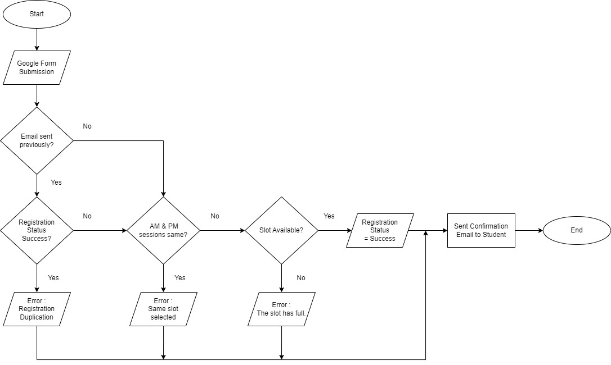

# SPKG2023 Google Form Submission Verification

This project aimed to create a verification system for Google Form submissions using Google Apps Script in JavaScript. Unfortunately, the implementation encountered a few issues, including difficulties with importing data from the Google Form into the script and persistent type errors.

## Problem Description

The goal of this project was to implement a verification process for submissions made through a Google Form. The script was designed to perform various checks on the submitted data, such as duplicate submissions, slot selections, and slot capacity. The script would update the submission status and send confirmation or error emails to the participants.

## Project Implementation Planning
We were planning to achirve the above mentioned goal by using Google Apps Script. We were planning to execute the code by following the flowchart below:

## Project Structure

The project includes the following files:

1. `Form_validator.js`: Contains the main script responsible for verifying form submissions. It checks for duplicate submissions, same slot selection, and slot capacity. It also sends success or error emails accordingly.

2. `try.js`: Includes a JavaScript class `FormValidate` and functions `emailSubmissionStatus` and `checkTime`. These functions handle specific form validation logic.

3. `valid.java`: Contains a Java implementation of the form verification logic. It checks if the email has been sent, the status of the email, the chosen slot, and the capacity.

## Usage

To use the script or code provided, follow these steps:

1. Open the Google Form and go to the **Script Editor**.
2. Copy and paste the contents of the `Form_validator.js` file into the Script Editor.
3. Save the script and set up any necessary triggers for form submission events.
4. Modify and adapt the code to fit your specific form and verification requirements.
5. Test the script thoroughly to ensure it functions as expected.
6. Make sure to handle any necessary data importation and type-related issues to avoid errors.

## Issues and Challenges

### Importing Data from Google Form

One of the challenges faced was importing the form responses data into the script. This step is crucial for performing the necessary checks and validations. Ensure that the script has the necessary permissions to access the form responses.

### Type Errors and Persistence

The script encountered persistent type errors while performing various operations on the form responses data. It's essential to ensure that the data types of variables and values are compatible to avoid such errors. Debugging and testing the script thoroughly can help identify and resolve these issues.

## Possible Solutions

### Data Import

Ensure that the script has the appropriate access and permissions to fetch the form responses data. Double-check the documentation and examples provided by Google Apps Script to understand the correct methods and syntax for importing data from Google Forms.

### Type Errors

To resolve type errors, pay close attention to variable declarations and conversions. Use appropriate methods to convert data types when necessary. Review the script and compare it with sample code or documentation to identify any inconsistencies.

### Debugging and Testing

Perform thorough testing of the script by running it in various scenarios. Use debugging techniques, such as console.log statements or breakpoints, to understand the flow of execution and identify any specific issues. Debugging can help pinpoint errors and guide you towards suitable solutions.

## Conclusion

While this attempt to create a verification system for Google Form submissions using Google Apps Script encountered challenges, it is important to iterate and learn from these experiences. Understanding the Google Apps Script documentation and APIs can provide valuable insights for resolving issues and improving the script's functionality.

## Contributing

Contributions to this project are welcome! If you have identified any solutions or improvements to the existing code, feel free to open a pull request. Additionally, you can report any issues or suggestions by creating a new issue in the project repository.